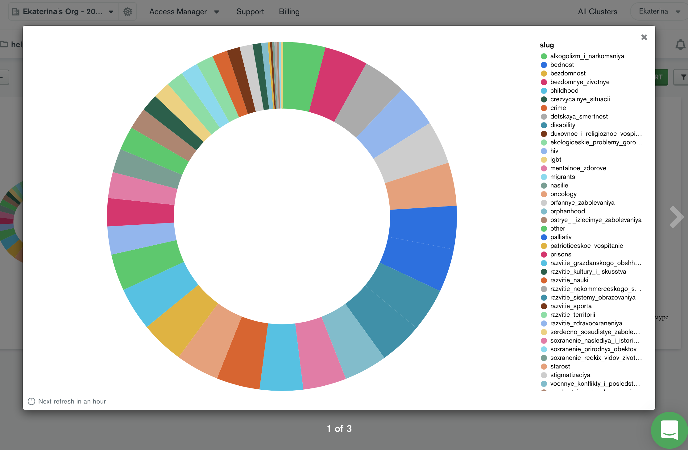

# "Как определиться, кому помогать?"
Интерактивная веб-анкета, созданная по заказу фонда "Нужна помощь". Стек: React+Express+MongoDB. 

## Функции приложения
Страница помогает пользователю выбрать, какому благотворительному фонду помогать. Проект был реализован в рамках хакатона Прожектор-2021 и вошел в топ-4 списка жюри.

## Команда
* [Екатерина Никифорова](https://github.com/elnikiforova) – full-stack developer и технический координатор проекта. Создание базы данных на основе API фонда "Нужна помощь", соединение бек- и фронт-сторон приложения, написание стилей React-компонентов по представленному дизайнером макету.
* [Анна Орлова](https://github.com/OrlovaAnn) – C++ developer. Проектирование и реализация React-компонента интерактивной анкеты.

## База данных и алгоритм выбора
Была составлена категоризированная база данных в Mongo Atlas, с опорой на категории был написан алгоритм отбора предложенных в пользователю фондов.

